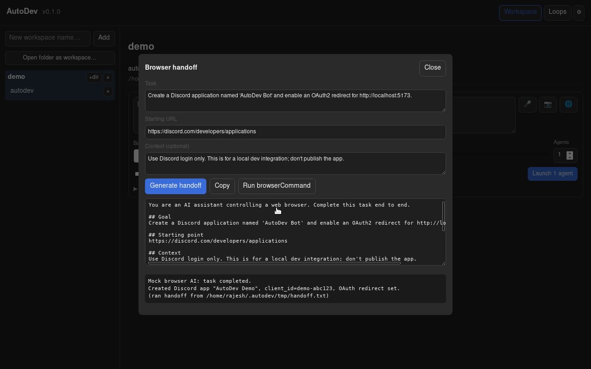

# AutoDev

A desktop app for running and managing many terminal coding agents (Claude Code, Codex,
Google Antigravity, Pi — and any other CLI you add) in parallel across multiple project
workspaces. It wraps the agents you already use with a workspace model, live status,
git-worktree isolation, voice and screenshot input, cross-agent annotation, an optional
autonomous build loop, and a file-based extension surface (backends, prompt templates, skills,
and JS extensions under `~/.autodev/`).

Built with Tauri (Rust core) and SolidJS. See [`PLAN.md`](PLAN.md) for the full roadmap
and [`LOOPS.md`](LOOPS.md) for the engineering method the project follows.

> Status: all planned phases (0–9) are implemented — workspaces, multi-agent
> orchestration, prompt composer, git-worktree isolation, voice input, screenshot +
> annotate, browser handoff, and the autonomous Planner/Generator/Evaluator loop — plus an
> extensibility track (pluggable backends, a public hook lifecycle, prompt templates, skills,
> JS extensions, a verified Pi backend, and cross-agent structured annotation). See
> [`handoff.md`](handoff.md) for exactly what works today and the known gaps, and
> [`PI-PARITY-PLAN.md`](PI-PARITY-PLAN.md) for the extensibility roadmap.

> **Demo:** [`demo/`](demo/) has a real screen recording of the app — 3 agents building an app in
> parallel, then the built app opened and used (`autodev-multi-agent-demo.mp4`) — plus a runnable
> no-GUI script. See [`docs/recording-a-demo.md`](docs/recording-a-demo.md) for how it was captured.

## Download

Prebuilt installers are attached to each [GitHub release](https://github.com/algorisys-oss/autodev/releases).
Grab the file for your platform from the latest release's **Assets**:

| Platform | Download | Install |
|---|---|---|
| **Linux** | `AutoDev_<version>_amd64.AppImage` | `chmod +x` it and run — a portable single file, no install. (Or use the `.deb`/`.rpm`.) |
| **macOS** | `AutoDev_<version>_universal.dmg` | Open the `.dmg` and drag AutoDev to Applications. |
| **Windows** | `AutoDev_<version>_x64-setup.exe` | Run the installer. |

To drive agents you still need at least one agent CLI on your `PATH` (`claude`, `codex`, `agy`,
`pi`, … — see [Agent backends](#2-agent-backends-install-at-least-one-on-your-path)), and on
Linux the WebKit/GTK system libraries listed under [Prerequisites](#prerequisites). Releases
are currently **unsigned**, so macOS Gatekeeper / Windows SmartScreen may warn on first launch
(right-click → Open on macOS; "More info → Run anyway" on Windows) — see
[Code signing & notarization](#code-signing--notarization) to publish signed builds.

## Prerequisites

You need three groups of things: a build toolchain (only to run from source), at least one
**agent backend** CLI, and — optionally — small helper tools for screenshots, voice, and the
browser handoff. If you installed a prebuilt release you can skip the build toolchain.

### 1. Build toolchain (to build / run from source)

- **Rust** (stable) and **Cargo** — https://rustup.rs
- **Node.js** 20+ and **npm**
- **git**
- **Linux system libraries** for Tauri (WebKitGTK), per distro:

  | Distro | Command |
  |---|---|
  | Debian / Ubuntu | `sudo apt-get install libwebkit2gtk-4.1-dev libgtk-3-dev librsvg2-dev libayatana-appindicator3-dev build-essential curl file` |
  | Fedora | `sudo dnf install webkit2gtk4.1-devel gtk3-devel librsvg2-devel libayatana-appindicator-gtk3-devel @development-tools` |
  | Arch | `sudo pacman -S webkit2gtk-4.1 gtk3 librsvg libayatana-appindicator base-devel` |

- **macOS** — `xcode-select --install` (Xcode command line tools).
- **Windows** — the **WebView2 runtime** (preinstalled on Windows 11) and the **MSVC v143 Build
  Tools** (Visual Studio Build Tools with the "Desktop development with C++" workload).

See https://tauri.app/start/prerequisites/ for the current authoritative list.

### 2. Agent backends (install at least one, on your `PATH`)

AutoDev drives real agent CLIs — install the ones you use. Adding *another* backend is a
drop-in `~/.autodev/backends/<id>.json` file (see [Extending](#extending-autodev)); no rebuild.

| Backend | Install | Binary |
|---|---|---|
| **Claude Code** | `npm i -g @anthropic-ai/claude-code` (or the [native installer](https://docs.claude.com/en/docs/claude-code)) | `claude` |
| **Codex** | `npm i -g @openai/codex` | `codex` |
| **Google Antigravity** | Follow [Google's Antigravity CLI](https://antigravity.google/) setup | `agy` |
| **Pi** | `npm i -g @earendil-works/pi-coding-agent`, then `pi` → `/login`, then copy [`examples/backends/pi.json`](examples/backends/pi.json) to `~/.autodev/backends/` | `pi` |

### 3. Optional helper tools (per feature)

Configure these in **Settings** (⚙) or `~/.autodev/settings.json`. The `{file}` placeholder is
replaced with a path AutoDev provides.

**Screenshots (📷).** AutoDev auto-detects a tool on Linux/macOS; if none is found it tells you.
Install one for your desktop, or set `screenshotCommand` yourself:

| Platform / desktop | Install | `screenshotCommand` |
|---|---|---|
| Linux — GNOME (Ubuntu, Wayland or X11) | `sudo apt install gnome-screenshot` | `gnome-screenshot -f {file}` |
| Linux — KDE Plasma | `sudo apt install kde-spectacle` | `spectacle -b -n -o {file}` |
| Linux — Sway / Hyprland (wlroots Wayland) | `sudo apt install grim` | `grim {file}` |
| Linux — generic X11 | `sudo apt install scrot` (or `maim`) | `scrot {file}` |
| macOS | built in | `screencapture -x {file}` (auto-detected) |
| Windows | built in (PowerShell) — see the one-liner below | `powershell -c "…{file}"` |

> **Notes.**
> - `grim` only works on **wlroots** compositors; on **GNOME/KDE Wayland** use `gnome-screenshot`
>   / `spectacle`. X11 tools (`scrot`, `maim`, ImageMagick `import`) capture a black frame under a
>   Wayland session.
> - **Windows** has no dedicated screenshot CLI, but PowerShell can grab the screen — set this as
>   `screenshotCommand` (it uses `.NET`, no install):
>   ```
>   powershell -NoProfile -Command "Add-Type -AssemblyName System.Windows.Forms,System.Drawing; $b=[System.Windows.Forms.Screen]::PrimaryScreen.Bounds; $m=New-Object Drawing.Bitmap $b.Width,$b.Height; ([Drawing.Graphics]::FromImage($m)).CopyFromScreen(0,0,0,0,$m.Size); $m.Save('{file}')"
>   ```

**Voice-to-text (🎤).** Any command that transcribes an audio `{file}` to stdout. Example with
[whisper.cpp](https://github.com/ggml-org/whisper.cpp) (`brew install whisper-cpp` on macOS, or
build from source on Linux): `whisper-cli -f {file} -otxt -of {file} && cat {file}.txt`. Set as
`transcribeCommand`.

**Browser handoff (🌐).** Node + [Playwright](https://playwright.dev): `cd browser-runner &&
npm install && npx playwright install chromium`, then set `browserCommand` to
`node /abs/path/browser-runner/browser-runner.mjs {file}`. See [Browser handoff](#browser-handoff).

**Open in editor.** Any editor with a CLI — `code`, `cursor`, `subl`, `nvim`. Set `editorCommand`
(default `code`). On macOS enable the `code` command via VS Code's *Shell Command: Install 'code'*.

## Quick start

```bash
git clone https://github.com/algorisys-oss/autodev.git
cd autodev
./dev.sh setup     # install npm + cargo dependencies
./dev.sh dev       # launch the app with hot reload
```

The first `dev` run compiles the Rust core, so it takes a few minutes. After that,
frontend changes hot-reload instantly and Rust changes trigger a quick rebuild.

## The `dev.sh` script

One entry point for everything:

| Command | What it does |
|---|---|
| `./dev.sh setup` | Install all dependencies (npm + `cargo fetch`) |
| `./dev.sh dev` | Run the app in development with hot reload |
| `./dev.sh build` | Produce a production build and platform bundle |
| `./dev.sh test` | Run all tests: Vitest (frontend) + `cargo test` (core) |
| `./dev.sh lint` | Lint and typecheck: eslint, tsc, clippy, rustfmt |
| `./dev.sh run` | Launch the built release binary (with the snap-env scrub) |
| `./dev.sh verify` | Everything CI runs: lint + test + build |
| `./dev.sh release X.Y.Z` | Bump the version, tag `vX.Y.Z`, and push — CI then builds the GitHub release |
| `./dev.sh help` | Show usage |

### Snap / VSCode note (Linux)

If you launch from a snap-packaged terminal or the snap build of VSCode, a native
GTK/WebKit binary can crash with `undefined symbol __libc_pthread_init` because snap
injects its own libraries into child processes. `dev.sh` strips those before launching,
so **always start the app with `./dev.sh dev`** rather than calling `npm run tauri dev`
directly from a snap shell. The same applies to a build you produced locally: run it with
**`./dev.sh run`** (which scrubs the snap vars) rather than executing
`src-tauri/target/release/autodev` directly — the raw binary crashes with that same
`__libc_pthread_init` error from a snap shell.

## Building a standalone executable

To produce a release build and self-contained installers for distribution:

```bash
./dev.sh build
```

This bundles the frontend (`vite build`), compiles the Rust core in release mode, and runs
`tauri build` (with the snap-env scrub, same as `dev`). It writes:

- **Standalone binary** — `src-tauri/target/release/autodev`. A single native executable; run
  it directly. Everything (frontend assets, Rust core) is embedded — there is no separate
  runtime to ship, though the host still needs the WebKit/GTK system libraries from
  [Prerequisites](#prerequisites).
- **Installers / portable bundles** — `src-tauri/target/release/bundle/`. The format matches
  the OS you build on (`bundle.targets` is `"all"`):
  - **Linux** — `appimage/AutoDev_0.1.0_amd64.AppImage` (a portable, double-clickable single
    file — the easiest thing to hand someone), plus `deb/` and `rpm/` packages.
  - **macOS** — `dmg/AutoDev_0.1.0_<arch>.dmg` and `macos/AutoDev.app`.
  - **Windows** — `msi/` (WiX) and `nsis/` (`.exe`) installers.

Notes:

- **Build on each target OS.** Tauri does not cross-compile between Linux/macOS/Windows in
  one step; run `./dev.sh build` on each platform you want to ship for.
- **Version** comes from `src-tauri/tauri.conf.json` (`version`); bump it there before a
  release so bundle filenames and the in-app version match.
- The app still shells out to the agent CLIs at runtime — whoever runs the bundle needs
  `claude`, `codex`, and/or `agy` on their `PATH`.

### Code signing & notarization

Unsigned builds run fine locally and for internal sharing. For public distribution (no
Gatekeeper/SmartScreen warnings) you need OS signing credentials — which are secrets, so this
repo ships **unsigned** and leaves the hooks for you to fill in:

- **macOS** — sign with a Developer ID and notarize. Provide, in the build environment:
  ```bash
  export APPLE_SIGNING_IDENTITY="Developer ID Application: Your Name (TEAMID)"
  export APPLE_ID="you@example.com"
  export APPLE_PASSWORD="app-specific-password"   # appleid.apple.com → App-Specific Passwords
  export APPLE_TEAM_ID="TEAMID"
  ./dev.sh build
  ```
  Tauri signs the `.app`, staples the notarization ticket, and produces the `.dmg`.
- **Windows** — set the signing cert in `src-tauri/tauri.conf.json` under
  `bundle.windows.certificateThumbprint` (plus `digestAlgorithm: "sha256"` and a
  `timestampUrl`), or wire `bundle.windows.signCommand` to Azure Trusted Signing for a
  cloud-held cert. Build on Windows.
- **Linux** — AppImages are not code-signed; distribute the `.AppImage` directly, or GPG-sign
  the `.deb`/`.rpm` in your package repository as usual.

In CI, store these as encrypted secrets and export them before `./dev.sh build`; the same
command produces signed artifacts once the credentials are present.

### Publishing a release (for maintainers)

Versioned binaries are distributed through **GitHub Releases**, the standard open-source way:
tag a version and CI builds the installers for every OS and attaches them to a release users can
download. This is automated by [`.github/workflows/release.yml`](.github/workflows/release.yml)
(using `tauri-action`), which runs a Linux/macOS/Windows matrix on any `v*` tag.

Cut a release with the helper — it bumps the version in both manifests, commits, tags, and pushes:

```bash
./dev.sh release 0.2.0        # bumps to 0.2.0, tags v0.2.0, pushes the tag
```

The pushed tag triggers the workflow, which builds every platform and creates a **draft** GitHub
release named `AutoDev v0.2.0` with the installers attached (`.AppImage`/`.deb`/`.rpm`, `.dmg`,
`.exe`). Open **Releases → the draft**, review the assets and notes, and click **Publish** — now
they show up on the [releases page](https://github.com/algorisys-oss/autodev/releases) and in the
[Download](#download) table for anyone to grab. To dry-run without cutting a tag, trigger the
workflow from the **Actions** tab (`workflow_dispatch`). Signed macOS builds require the `APPLE_*`
repo secrets above; without them the release ships unsigned.

## Usage

1. Open a **workspace** pointed at a folder that holds your projects, and add the project
   directories you work in (API, app, UI, …).
2. Compose a prompt, `@`-mention the projects it needs for context, pick a difficulty, and
   launch one or more agents (Claude Code, Codex, or Antigravity).
3. Watch each agent's status dot and terminal — `running`, `idle`, `waiting` (blocked on a
   prompt), `exited`, or `error` — isolate risky ones in a git worktree, and feed them voice
   or annotated-screenshot context.
4. Open **Settings** (⚙ in the header) to configure the pluggable voice, screenshot, and
   browser-handoff commands.
5. Use the **Loops** tab to run an autonomous Planner → Generator → Evaluator loop against a
   project; tick **Auto-run** for a fully hands-off pass.

Configuration and state live at `~/.autodev/` (settings, prompt history, per-agent logs,
loop state).

## Extending AutoDev

Everything below is a plain file under `~/.autodev/` — drop it in, restart, done. No rebuild.
(The in-app **Help** panel — the `?` in the header — documents all of this too.)

| Add… | Where | What it does |
|---|---|---|
| **A backend** | `~/.autodev/backends/<id>.json` | A new agent CLI in the Backend picker. Declarative flag mapping; see [`examples/backends/`](examples/backends/) (includes a verified **Pi** spec). |
| **A prompt template** | `~/.autodev/templates/<name>.md` | Type `/name` in the task box to expand it (Tab or click). |
| **Skills** | `~/.autodev/skills/` | Files added to *every* agent's context on every backend. |
| **An extension** | `~/.autodev/extensions/<name>.js` | Trusted JS that registers lifecycle hooks and composer commands. Surfaced in Settings. ⚠ runs with the app's full access. |

### Browser handoff

Terminal coding agents can't finish tasks that need a *browser* — creating a Discord app,
setting up OAuth, configuring a dashboard, signing up for a service. **Browser handoff** bridges
that: it turns a web task into a structured brief you hand to a browser-driving AI.



1. Click **🌐** in the composer, then describe the task: a **goal**, an optional **starting URL**,
   and any **context/constraints**.
2. **Generate handoff** produces a structured prompt — `## Goal`, `## Starting point`, `## Context`,
   `## How to proceed`, and a `## Report back` section asking the browser AI to return any
   credentials / IDs / URLs it created and anything that needs your input.
3. Then either **Copy** it into any browser AI (a Comet-style agent, a browsing-enabled assistant),
   or **Run browserCommand** to execute it automatically.

The **`browserCommand`** is a pluggable shell template in `~/.autodev/settings.json` (or the ⚙
Settings panel) with a `{file}` placeholder. AutoDev writes the handoff to that file, runs the
command, and shows its output back in the modal. Without a `browserCommand` configured, the
**Run** button returns a clear "not configured" error — the copy-into-a-browser-AI path always
works.

A ready-to-use example lives in [`browser-runner/`](browser-runner/) — a self-contained Playwright
runner that opens a real browser at the handoff's starting URL and screenshots it. Set up with
`cd browser-runner && npm install && npx playwright install chromium`, then point `browserCommand`
at `node /abs/path/browser-runner/browser-runner.mjs {file}`.

## Project layout

```
autodev/
  src/                 SolidJS frontend
    lib/ipc.ts         typed wrappers over Tauri commands (the shared contract)
    App.tsx            app shell
  src-tauri/           Rust core
    src/
      lib.rs           Tauri builder, command registration
      commands.rs      #[tauri::command] handlers
      state.rs         on-disk state (~/.autodev)
      error.rs         command-boundary error type
    tauri.conf.json    app config
  dev.sh               developer entry point
  PLAN.md              build roadmap
  LOOPS.md             engineering method
  CLAUDE.md            guidance for AI agents working in this repo
```

### Where state is stored

All app state lives under `~/.autodev/` (flat JSON, outside the repo):

```
~/.autodev/
  workspaces.json        workspaces and their project directories
  settings.json          theme, default effort, pluggable command templates
  prompts.json           prompt history
  logs/<agent-id>.log    per-agent raw output
  loops/<loop-id>/       autonomous-loop state (state.json, contract.md, …)
```

**Adding a workspace or a project only records metadata** — `workspaces.json` stores the
workspace's name/id and each project's name + **absolute path**. Your project files are never
copied or moved; the app just references the directories where they already are.

## Contributing

Read [`CLAUDE.md`](CLAUDE.md) and [`LOOPS.md`](LOOPS.md) first — they define how work is
done here (scope lock, tests first, verify before claiming done). Run `./dev.sh verify`
before opening a PR.

## License

[GNU AGPL v3](LICENSE).
