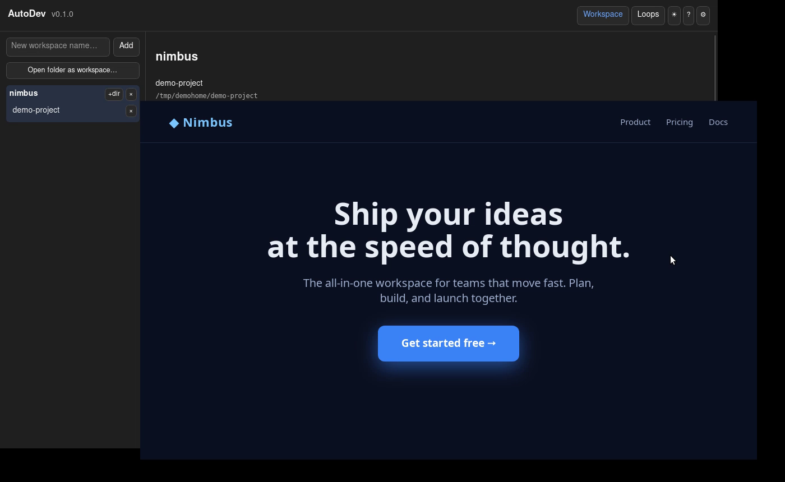

# AutoDev demo — multi-agent, in parallel, isolated per worktree

**AutoDev's core move:** fan a task out to N agents, isolate each on its own `git worktree`, run
them in parallel, then merge the results back.

## Screen recording of the real app

[`autodev-multi-agent-demo.mp4`](autodev-multi-agent-demo.mp4) — a real screen recording of the
desktop app, end to end: type a task, set **3 agents** + **Isolate (worktree)**, launch, and watch
three real `claude` agents each build a to-do app (`index.html` / `style.css` / `app.js`) in
parallel, each in its own worktree, with live terminals and status dots — **then the built app is
opened and used** (add a few items, delete one) to prove it actually works. Captured headlessly on
a virtual display — see [`docs/recording-a-demo.md`](../docs/recording-a-demo.md) for exactly how.

## Per-agent prompts — divide one project across the fan-out

[`autodev-per-agent-prompts-demo.mp4`](autodev-per-agent-prompts-demo.mp4) — a real screen
recording of the composer's **per-agent prompts**: type one shared task, set **2 agents**, tick
**Per-agent prompts** (which auto-enables **Isolate**), then give each agent its own instruction —
`@web-shop build the product grid UI` and `@api-service add a GET /products endpoint`. One Launch
fans out two `claude` agents, each with its **own** prompt and `@`-mentioned project, each in its
own worktree. This is the "N copies of one task" fan-out turned into "N different sub-tasks of one
project". Captured headlessly on a virtual display, same method as above.

## Build → screenshot → annotate → fix (a real UI iteration)

[`screenshot-annotation-demo.mp4`](screenshot-annotation-demo.mp4) — a real screen recording of a
full visual-feedback loop:

1. An agent **builds** a landing page for "Nimbus" with the call-to-action button **on the right**.
2. The built page is **opened** — you can see the button hugging the right edge.
3. **📷** captures the screen; in the annotator an arrow marks the button and a note says
   *"Move the call-to-action button to the center."*
4. **Attach + Launch** hands that back to an agent — and the page **reopens with the button
   centered**.

The annotation note travels as **prompt text**, so it drives the fix on any backend (not just ones
that read images). Captured headlessly on a virtual display — screenshots via ffmpeg `x11grab`, the
built page shown in a WebKit viewer, driving a real release build with a drop-in demo "builder"
backend.



## Runnable script (no GUI, no auth)

For a version you can run anywhere in seconds, `multi-agent-demo.sh` reproduces the same
orchestration with plain `git` + `bash`: three agents build a tiny calculator library at once —
one writes `add.js`, one `sub.js`, one the tests — each on its own branch, merged into `main` at
the end.

## Watch the recording

The captured run is in [`multi-agent-demo.txt`](multi-agent-demo.txt) (plain text — readable
right here on GitHub). For the real terminal session with colours and timing, replay it:

```bash
scriptreplay --timing=demo/multi-agent-demo.timing demo/multi-agent-demo.rec
```

## Run it yourself

```bash
./demo/multi-agent-demo.sh
```

No GUI, no API keys, nothing left behind — it works entirely in a temp git repo and cleans up
after itself. Needs only `git` and `bash` (plus `node`, optionally, to run the agents' tests).

## What it maps to in the app

The script uses plain `git` + `bash` so it runs anywhere, but the orchestration shape is exactly
what the desktop app does:

| Demo step | In AutoDev |
|---|---|
| 3 branches/worktrees created up front | Composer: set **agent count = 3**, tick **Isolate (worktree)** |
| Each agent works only in its own worktree, in parallel | The agent grid — N live agents, each its own terminal + status dot |
| `git merge --no-ff` each branch into `main` | The focused agent's **Merge** button (refuses a dirty target) |

The difference in the real app: each "agent" is a live coding agent — **Claude Code, Codex, or
Google Antigravity** — driven in a real PTY, not the canned steps here. You type one task, launch,
and watch them work in parallel; the isolation and merge-back are the same.

## Files

- `autodev-multi-agent-demo.mp4` — real screen recording of the app (see above).
- `autodev-per-agent-prompts-demo.mp4` — real screen recording of per-agent prompts (see above).
- `multi-agent-demo.sh` — the runnable no-GUI demo.
- `multi-agent-demo.txt` — plain-text transcript of a run (the "recording").
- `multi-agent-demo.rec` + `multi-agent-demo.timing` — `script`(1) capture for `scriptreplay`.
